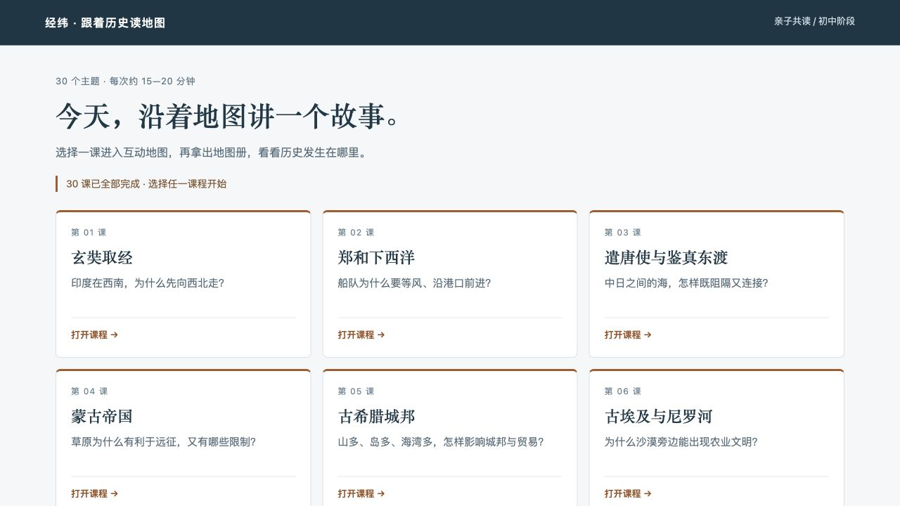
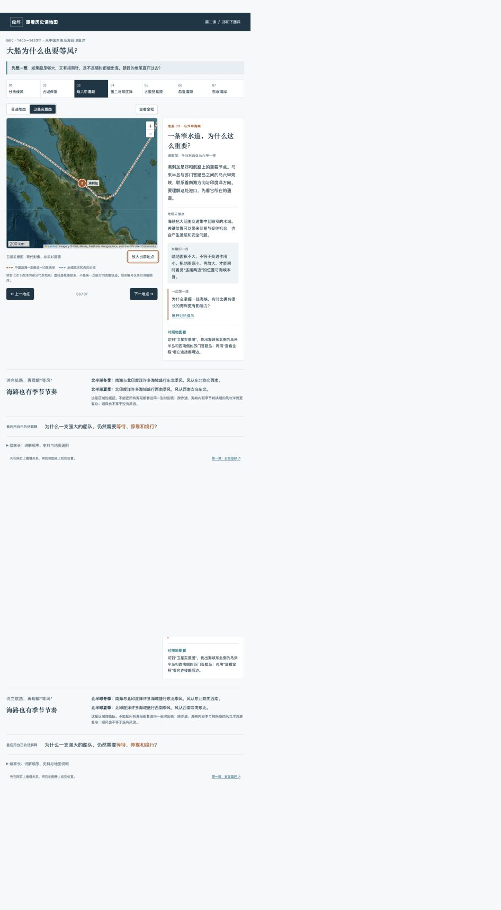

# 跟着历史读地图

**每天一段历史，一张地图，一次有内容的亲子对话。**

面向初中生与家长的个人教育项目：把主流历史主题做成可以一起探索的地图课程。每课约 15—20 分钟，从一个问题出发，借助路线、地形、海峡和港口，理解历史人物面对的条件与选择。

**[打开30课课程目录 →](https://history-geography-lessons-cheng.ivanxia1988.chatgpt.site)** · [阅读完整课程方案](30天亲子历史地理谈话方案.md) · [反馈与建议](https://github.com/ivanxia1988/history-geography-lessons/issues)

网页公开访问，无需登录或密码。当前已完成 **30 / 30** 课，均可从目录进入互动网页。



## 为什么做这个项目

这个项目起于一个具体的亲子学习需求：孩子已经上初中，讲历史不能只停留在人物故事，也不希望每天变成背地名和年代。

例如，印度在长安西南，玄奘为什么先向西北走？郑和的船队已经很强大，为什么还要等风？中日之间的海，为什么既是障碍，也是交流的通道？

用地图把这些问题摆出来，再一起讨论补给、季节、技术、外交与人的选择。地理帮助解释历史，但不是唯一答案。

## 已完成课程

| 课程 | 核心问题 | 在线体验 |
| --- | --- | --- |
| 01 · 玄奘取经 | 印度在西南，为什么先向西北走？ | [进入课程](https://xuanzang-map-lesson-cheng.ivanxia1988.chatgpt.site) |
| 02 · 郑和下西洋 | 船队为什么要等风、沿港口前进？ | [进入课程](https://zhenghe-map-lesson-cheng.ivanxia1988.chatgpt.site) |
| 03 · 遣唐使与鉴真东渡 | 中日之间的海，怎样既阻隔又连接？ | [进入课程](https://jianzhen-map-lesson-cheng.ivanxia1988.chatgpt.site) |
| 04 · 蒙古帝国 | 草原为什么有利于远征，又有哪些限制？ | [进入课程](https://history-geography-lessons-cheng.ivanxia1988.chatgpt.site/lessons/04/) |
| 05 · 古希腊城邦 | 山多、岛多、海湾多，怎样影响城邦与贸易？ | [进入课程](https://history-geography-lessons-cheng.ivanxia1988.chatgpt.site/lessons/05/) |
| 06 · 古埃及与尼罗河 | 为什么沙漠旁边能出现农业文明？ | [进入课程](https://history-geography-lessons-cheng.ivanxia1988.chatgpt.site/lessons/06/) |
| 07 · 两河流域的城市 | 有河不等于有好生活，人还要做什么？ | [进入课程](https://history-geography-lessons-cheng.ivanxia1988.chatgpt.site/lessons/07/) |
| 08 · 张骞与河西走廊 | 一条狭长地带为什么值得反复争夺？ | [进入课程](https://history-geography-lessons-cheng.ivanxia1988.chatgpt.site/lessons/08/) |
| 09 · 李冰与都江堰 | 怎样把洪水的威胁变成灌溉的条件？ | [进入课程](https://history-geography-lessons-cheng.ivanxia1988.chatgpt.site/lessons/09/) |
| 10 · 诸葛亮北伐 | 山能保护一个政权，为什么也会困住它？ | [进入课程](https://history-geography-lessons-cheng.ivanxia1988.chatgpt.site/lessons/10/) |
| 11 · 隋朝大运河 | 天然河流多向东，为什么要修南北水道？ | [进入课程](https://history-geography-lessons-cheng.ivanxia1988.chatgpt.site/lessons/11/) |
| 12 · 《清明上河图》里的开封 | 为什么一座大城市的生活要围着河流转？ | [进入课程](https://history-geography-lessons-cheng.ivanxia1988.chatgpt.site/lessons/12/) |
| 13 · 明成祖迁都北京 | 首都为什么未必建在最富庶的地方？ | [进入课程](https://history-geography-lessons-cheng.ivanxia1988.chatgpt.site/lessons/13/) |
| 14 · 罗马与地中海 | 一片海怎样成为帝国的交通骨干？ | [进入课程](https://history-geography-lessons-cheng.ivanxia1988.chatgpt.site/lessons/14/) |
| 15 · 汉尼拔翻越阿尔卑斯山 | 为什么有时主动选择险路？ | [进入课程](https://history-geography-lessons-cheng.ivanxia1988.chatgpt.site/lessons/15/) |
| 16 · 亚历山大东征 | 军队能向前走，统治就能跟上吗？ | [进入课程](https://history-geography-lessons-cheng.ivanxia1988.chatgpt.site/lessons/16/) |
| 17 · 君士坦丁堡 | 为什么这座城市长期被反复争夺？ | [进入课程](https://history-geography-lessons-cheng.ivanxia1988.chatgpt.site/lessons/17/) |
| 18 · 威尼斯 | 没有大片农田的水城，怎样成为商贸中心？ | [进入课程](https://history-geography-lessons-cheng.ivanxia1988.chatgpt.site/lessons/18/) |
| 19 · 达·伽马绕过非洲 | 欧洲人为什么愿意绕那么远去印度？ | [进入课程](https://history-geography-lessons-cheng.ivanxia1988.chatgpt.site/lessons/19/) |
| 20 · 哥伦布向西航行 | 一个地理判断的错误，怎样改变世界？ | [进入课程](https://history-geography-lessons-cheng.ivanxia1988.chatgpt.site/lessons/20/) |
| 21 · 麦哲伦—埃尔卡诺船队 | 横跨大洋，最难的只是找到海峡吗？ | [进入课程](https://history-geography-lessons-cheng.ivanxia1988.chatgpt.site/lessons/21/) |
| 22 · 土豆、玉米与辣椒的旅行 | 今天的家常饭，为什么带着世界航海史？ | [进入课程](https://history-geography-lessons-cheng.ivanxia1988.chatgpt.site/lessons/22/) |
| 23 · 英国工业革命 | 工厂为什么在一些地方聚集起来？ | [进入课程](https://history-geography-lessons-cheng.ivanxia1988.chatgpt.site/lessons/23/) |
| 24 · 拿破仑远征俄国 | 占领重要城市，为什么仍可能输掉战争？ | [进入课程](https://history-geography-lessons-cheng.ivanxia1988.chatgpt.site/lessons/24/) |
| 25 · 美国横贯大陆铁路与华工 | 一条铁路怎样改变距离的意义？ | [进入课程](https://history-geography-lessons-cheng.ivanxia1988.chatgpt.site/lessons/25/) |
| 26 · 美国南北战争与密西西比河 | 控制一条河，怎样影响整个战场？ | [进入课程](https://history-geography-lessons-cheng.ivanxia1988.chatgpt.site/lessons/26/) |
| 27 · 苏伊士运河 | 一条人工水道怎样改变世界航路？ | [进入课程](https://history-geography-lessons-cheng.ivanxia1988.chatgpt.site/lessons/27/) |
| 28 · 巴拿马运河 | 船为什么需要坐“水上电梯”？ | [进入课程](https://history-geography-lessons-cheng.ivanxia1988.chatgpt.site/lessons/28/) |
| 29 · 诺曼底登陆 | 军事行动为什么要听气象预报？ | [进入课程](https://history-geography-lessons-cheng.ivanxia1988.chatgpt.site/lessons/29/) |
| 30 · 上海港的成长 | 一座港口城市，怎样连接内陆与世界？ | [进入课程](https://history-geography-lessons-cheng.ivanxia1988.chatgpt.site/lessons/30/) |

完整安排见[三十天谈话方案](30天亲子历史地理谈话方案.md)。这里的“30天”是30次独立谈话，不要求连续打卡。

## 一课怎么使用

1. **先提问题**：让孩子看地图、做判断，暂时不揭示答案。
2. **沿地点讲故事**：点击地图地点，阅读故事、地理关键点与趣味细节。
3. **观察真实地貌**：从第二课开始，可以切换普通地图与卫星实景图，观察海岸、海峡、山地和聚落。
4. **一起讨论**：先听孩子解释，再展开家长讨论提示。
5. **回到地图册**：找到刚刚讲过的地方，用自己的话解释它们之间的关系。

每课附史料来源和地图使用说明。历史路线是概略示意；现代影像不是古代地貌复原，也不是实时画面。



## 当前形式与后续方向

- 保留地点点击、拖动缩放、上一地点／下一地点，以及对应讲解。
- 第二课起采用二维地图与卫星影像切换，优先保证清楚、易读、便于家长讲述。
- 第一课保留早期三维地形探索版本；后续课程不再扩展飞行或自动巡游。
- 每课保留独立内容目录，来源、讲解稿和课程链接同步维护。

## 源码与本地预览

项目是静态 HTML、CSS、JavaScript，无需安装前端依赖。Python 3 用于本地预览和目录生成；JavaScript 语法检查可使用 Node.js。

```text
course-index/                  30课目录网页与课程链接数据
  lessons/04—30/               后续课程独立内容目录：lesson.json与讲解稿
  lesson-template/             后续课程共用二维地图模板
xuanzang-lesson/               第一课：玄奘取经
zhenghe-lesson/                第二课：郑和下西洋
jianzhen-lesson/               第三课：遣唐使与鉴真东渡
30天亲子历史地理谈话方案.md      完整选题与家长备讲提纲
AGENTS.md                      课程制作约定
```

从仓库根目录预览第三课：

```bash
python3 -m http.server 8000 --bind 127.0.0.1 --directory jianzhen-lesson/dist
```

打开 <http://127.0.0.1:8000>。将 `--directory` 改为 `course-index/dist` 或其他课程的 `dist` 目录即可预览对应页面。目录中的课程链接默认指向已发布网站。在线地图、影像和第一课的高程数据需要网络。

新增课程上线后，更新 `course-index/courses.json`，再运行：

```bash
python3 course-index/build_lessons.py --link
python3 course-index/build_catalog.py
```

构建器只生成已有完整地图节点的课程；仍须逐课核对史实并完成网页检查后才使用 `--link`。同时更新本 README 与三十天方案中的课程入口。GitHub 保存源码与项目介绍，当前在线体验由 Sites 托管；推送 GitHub 不会自动更新 Sites 网站。本机 Sites 项目关联配置不纳入此公开仓库。

## 来源与署名

地图使用 OpenStreetMap、Esri 及相应数据提供方的服务，备用海陆轮廓来自 Natural Earth。浏览器地图组件包括 Leaflet，第一课另使用 MapLibre GL JS。组件许可保留在各课程的 `dist/vendor/` 中；地图版权标注保留在网页内，历史资料入口见每课的资料说明。

项目由 [Ivan Xia](https://github.com/ivanxia1988) 维护。欢迎通过 [Issues](https://github.com/ivanxia1988/history-geography-lessons/issues) 提交史实纠错、地图问题或使用反馈。
